<h1 align="center">Jakub Nalewajk</h1>

  Fullstack Developer specializing in <strong>Next.js</strong> and the <strong>TypeScript ecosystem</strong>. 
  I build web applications and SaaS products with a focus on clean architecture and performance.

---

### 🧰 Tech Stack

  

---

### ⚙️ How I Work
- **Architecture-first** - feature-driven structure, scalable from day one
- **Full pipeline** - CI/CD with Docker, GitHub Actions, self-hosted on VPS
- **Monorepo experience** - Nx and Turborepo across production projects

---

### 📈 GitHub Stats

  

---

### 📫 Connect
- 🌐 [Portfolio](https://jnalewajk.me)
- 💼 [LinkedIn](https://www.linkedin.com/in/jakub-nalewajk/)
- 📊 [Status Page](https://status.jnalewajk.me)
